# AEMOVis - AEMO Energy Visualisation Dashboard

## Context

AEMO's existing dashboards (NEM Data Dashboard, WEM Data Dashboard) use embedded Power BI with dated UX, slow loading, and limited interactivity. AEMOVis will be a modern React + ECharts app that provides superior visualisations for all 4 data domains: generation mix, spot price & demand, renewables penetration, and interconnector flows.

**Key discovery:** AEMO has a public JSON API at `dashboards.public.aemo.com.au` with a publicly-available API key. This gives us real-time 5-minute data without scraping CSVs.

---

## Decoded AEMO Public API

**Base URL:** `https://dashboards.public.aemo.com.au`
**Auth:** `x-api-key: <your-api-key>` (set via `VITE_AEMO_API_KEY` env var — get yours at https://dev.aemo.com.au/)

### NEM Endpoints (all verified working)

| Endpoint | Params | Data |
|----------|--------|------|
| `GET /NEM/v1/PWS/NEMDashboard/elecSummary` | none | Real-time per-region: price, demand, gen, interconnector flows |
| `GET /NEM/v1/PWS/NEMDashboard/priceAndDemand` | `region={NSW1\|QLD1\|VIC1\|SA1\|TAS1}`, `TimeScale={5MIN\|30MIN}` | Time series: rrp, totalDemand, scheduledGen, semiScheduledGen, netInterchange |
| `GET /NEM/v1/PWS/NEMDashboard/fuelMix` | `region={NSW1\|NEM}`, `Type={CURRENT\|24H\|48H\|3M\|12M}` | Per-fuelType supply (MW/MWh) |
| `GET /NEM/v1/PWS/NEMDashboard/cumulativePrice` | `region={region}` | Time series: dt, p (price), cp (cumulative price), r (region) |
| `GET /NEM/v1/PWS/NEMDashboard/renewablePenetration` | `region={NEM\|region}` | Historical min/max penetration, fuel mix breakdown |
| `GET /NEM/v1/PWS/NEMDashboard/sevenDayOutlook` | `region={region}` | 7-day forecast: Net Interchange, Scheduled Capacity, etc. |
| `GET /NEM/v1/PWS/NEMDashboard/dailyAveragePrices` | `year={YYYY}`, `month={1-12}` | Daily avgRrp, peakRrp per region |
| `GET /NEM/v1/PWS/NEMDashboard/monthlyAveragePrices` | `year={YYYY}`, `month={1-12}` | Monthly avgRrp, peakRrp per region |
| `GET /NEM/v1/PWS/NEMDashboard/annualAveragePrices` | none | Annual avgRrp per region (2010-present) |
| `GET /NEM/v1/PWS/NEMDashboard/marketPriceLimits` | none | APC ($600), CPT ($1,823,600), MPC ($20,300) |

### WEM Endpoint

| Endpoint | Params | Data |
|----------|--------|------|
| `GET /WEM/v1/PWS/WEMDashboard/marketPulse` | none | WA time series: price, forecastMw, actualTotalGeneration, actualNsgMw, outages |

### Fuel Type Color Map (from AEMO config.json)

| Fuel Type | Color | Renewable |
|-----------|-------|-----------|
| Black coal | `#333536` | No |
| Brown coal | `#97785C` | No |
| Gas | `#34B9B3` | No |
| Solar | `#FFD565` | Yes |
| Wind | `#A1D978` | Yes |
| Hydro | `#ADE0EE` | Yes |
| Battery | `#B056BC` | Yes |
| Biomass | `#A82140` | Yes |
| Liquid Fuel | `#FE5F55` | No |
| Rooftop PV | `#FFED90` | Yes |

---

## Architecture

### High-Level System


### Component Architecture


### Data Flow


### File Structure

```
src/
  api/
    client.ts              # Fetch wrapper with x-api-key header
    types.ts               # API response types
  hooks/
    useElecSummary.ts      # Real-time dispatch overview
    usePriceAndDemand.ts   # Price & demand time series
    useFuelMix.ts          # Fuel mix by type/region/period
    useRenewablePenetration.ts
    useSevenDayOutlook.ts
    useAveragePrices.ts    # Daily/monthly/annual
    useMarketPulse.ts      # WEM data
  components/
    charts/
      KpiCard.tsx          # Price/demand/% stat cards
      StackedAreaChart.tsx  # Generation mix over time
      DualAxisChart.tsx     # Price + demand overlay
      HorizontalBar.tsx    # Fuel mix breakdown bars
      FlowMap.tsx          # NEM interconnector flow map
      RenewableGauge.tsx   # Ring gauge for renewable %
    controls/
      RegionSelector.tsx   # NSW | QLD | VIC | SA | TAS | NEM tabs
      TimeRangePicker.tsx  # CURRENT | 24H | 48H | 3M | 12M
      TimeScaleToggle.tsx  # 5MIN | 30MIN dispatch/pre-dispatch
    layout/
      AppLayout.tsx        # Sidebar nav + header + content area
      Sidebar.tsx          # Navigation between pages
  pages/
    OverviewPage.tsx       # Dashboard home - KPIs + mini charts
    PriceDemandPage.tsx    # Dual-axis price/demand by region
    FuelMixPage.tsx        # Stacked area + bar breakdown
    RenewablesPage.tsx     # Penetration gauge + trends
    InterconnectorsPage.tsx # NEM map + flow data
    HistoricalPage.tsx     # Annual/monthly/daily price trends
  theme/
    echarts-theme.ts       # ECharts theme registration
    fuel-colors.ts         # Fuel type -> color/icon mapping
    ThemeContext.tsx        # Dark/light toggle context
  App.tsx
  main.tsx
```

---

## Implementation Plan

### Phase 1: Project Scaffolding ✅
1. Vite + React + TypeScript scaffold
2. Install deps: echarts, echarts-for-react, react-router-dom, @tanstack/react-query
3. API client with base URL + API key + Vite proxy
4. TanStack Query provider with 5-min stale time
5. ECharts theme with AEMO fuel colors
6. React Router with page stubs
7. App layout with sidebar nav

### Phase 2: Data Layer (hooks + types) 🔄
1. TypeScript types for all API responses
2. API client (api/client.ts) with error handling
3. All 8 data hooks with TanStack Query
4. Auto-refresh (refetchInterval: 300000 for 5-min data)

### Phase 3: Chart Components
1. KpiCard - Stat card with value, label, trend
2. StackedAreaChart - Generic stacked area (fuel mix over time)
3. DualAxisChart - Price ($/MWh) + Demand (MW) dual-axis
4. HorizontalBar - Fuel mix breakdown with AEMO colors
5. RenewableGauge - Ring gauge showing renewable %
6. FlowMap - SVG map of NEM regions with interconnector flows

### Phase 4: Pages
1. OverviewPage - 5 region KPI cards + NEM fuel mix donut + interconnector map
2. PriceDemandPage - Region tabs + 5MIN/30MIN toggle + dual-axis chart
3. FuelMixPage - Region/NEM tabs + period picker + stacked area + breakdown
4. RenewablesPage - Gauge + penetration trend + min/max stats
5. InterconnectorsPage - Interactive NEM flow map with live data
6. HistoricalPage - Annual/monthly/daily average price charts

### Phase 5: Polish
1. Dark/light theme toggle (default dark)
2. Responsive layout
3. Loading states + error boundaries
4. Linked tooltips across charts
5. CSV export button

---

## Tech Stack

| Library | Purpose |
|---------|---------|
| React 19 | UI framework |
| Vite 6 | Build tool |
| TypeScript 5.7 | Type safety |
| echarts 5.6 | Charting engine |
| echarts-for-react | React wrapper |
| react-router-dom 7 | Client-side routing |
| @tanstack/react-query 5 | Data fetching + cache |

No backend needed - direct browser-to-AEMO API calls via Vite dev server proxy.

---

## Interconnector Flow Map Design

```mermaid
graph TB
    QLD["QLD<br/>$79.83/MWh<br/>8,157 MW"]
    NSW["NSW<br/>$76.06/MWh<br/>8,284 MW"]
    VIC["VIC<br/>$8.95/MWh<br/>4,713 MW"]
    SA["SA<br/>-$7.01/MWh<br/>1,153 MW"]
    TAS["TAS<br/>$106.10/MWh<br/>1,005 MW"]

    QLD <-->|"NSW1-QLD1<br/>662 MW →"| NSW
    QLD <-->|"N-Q-MNSP1<br/>41 MW →"| NSW
    NSW <-->|"VIC1-NSW1<br/>30 MW →"| VIC
    VIC <-->|"V-SA<br/>417 MW →"| SA
    VIC <-->|"V-S-MNSP1<br/>175 MW →"| SA
    VIC <-->|"T-V-MNSP1<br/>← 230 MW"| TAS
```



- Nodes: rounded rectangles with region name, spot price, demand
- Edges: animated dashed lines with arrow direction showing flow
- Edge width proportional to MW flow magnitude
- Color: green (within limits), orange (near limit), red (at limit)
- Node background color intensity based on price
- Click node to drill into that region's price/demand page
