# 1. Introduction

## What is AEMOVis?

AEMOVis is a real-time energy dashboard that visualises data from the **Australian Energy Market Operator (AEMO)**. It provides an interactive, modern interface for exploring electricity market data across all regions of Australia's National Electricity Market (NEM) and the Western Australian Wholesale Electricity Market (WEM).

The application fetches live data from AEMO's public API and presents it through interactive charts, maps, and summary cards — making complex energy market data accessible and understandable.

## Who is it for?

- **Energy analysts** monitoring market conditions and price trends
- **Grid operators** tracking demand, generation, and interconnector flows
- **Researchers** studying renewable energy penetration and fuel mix transitions
- **Policy makers** reviewing historical pricing and market dynamics
- **Students and educators** learning about Australia's electricity markets

## Key Links

| Resource | URL |
|----------|-----|
| AEMO Home | <https://www.aemo.com.au> |
| NEM Data Dashboard | <https://www.aemo.com.au/energy-systems/electricity/national-electricity-market-nem/data-nem/data-dashboard-nem> |
| WEM Data Dashboard | <https://www.aemo.com.au/energy-systems/electricity/wholesale-electricity-market-wem/data-wem/data-dashboard> |
| AEMO Developer Portal | <https://dev.aemo.com.au/> |
| NEM Data & Reporting | <https://www.aemo.com.au/energy-systems/electricity/national-electricity-market-nem/data-nem> |
| WEM Data & Reporting | <https://www.aemo.com.au/energy-systems/electricity/wholesale-electricity-market-wem> |

---

# 2. Architecture Overview

## System Architecture

AEMOVis is a single-page application (SPA) that communicates with AEMO's public API through a Vite development proxy. The browser never contacts AEMO directly — all API calls are routed through the proxy to avoid CORS restrictions.

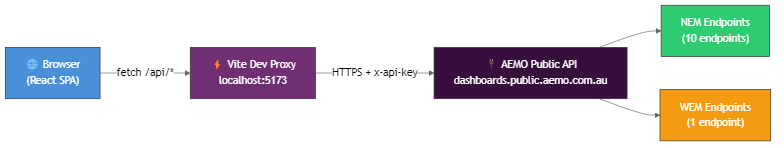

The proxy rewrites requests from `/api/*` to the AEMO API base URL (`https://dashboards.public.aemo.com.au`), appending the required `x-api-key` header.

## Data Pipeline

Data flows through a well-defined pipeline from the AEMO API to the rendered charts:

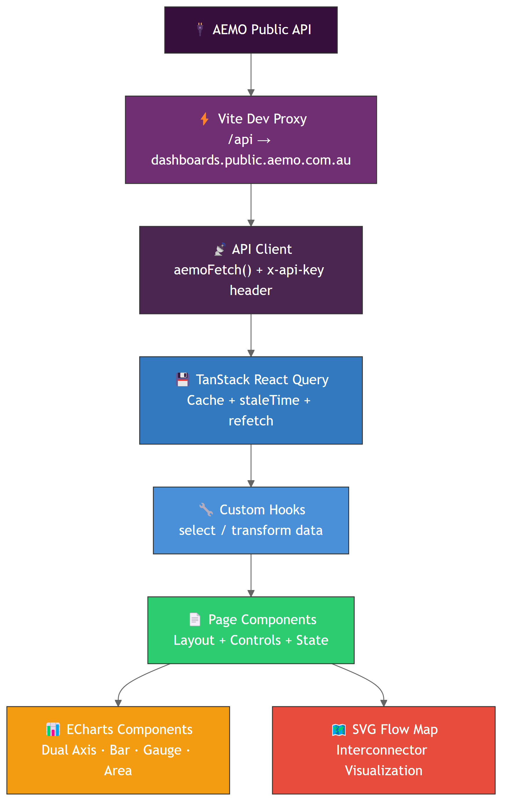

1. **AEMO Public API** — The authoritative data source for all NEM and WEM market data
2. **Vite Dev Proxy** — Rewrites `/api` requests to the AEMO domain, handling CORS
3. **API Client (`aemoFetch`)** — TypeScript fetch wrapper that adds the API key header
4. **TanStack React Query** — Manages caching, staleness, retries, and background refetching
5. **Custom Hooks** — Transform and select relevant data from API responses
6. **Page Components** — Compose charts, controls, and KPI cards
7. **ECharts / SVG** — Render interactive visualisations

## Component Hierarchy

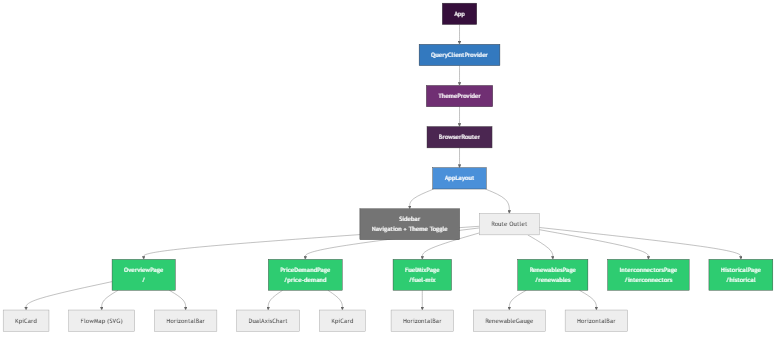

## Tech Stack

| Technology | Version | Purpose |
|-----------|---------|---------|
| React | 19.2 | UI component framework |
| TypeScript | 5.9 | Type-safe JavaScript |
| Vite | 7.3 | Build tool and dev server with HMR |
| TanStack React Query | 5.90 | Server state management and caching |
| ECharts | 6.0 | Charting library (line, bar, gauge, area) |
| echarts-for-react | 3.0 | React wrapper for ECharts |
| React Router | 7.13 | Client-side routing |

## Theme System

AEMOVis supports **dark mode** and **light mode**, toggled via the sidebar button.

- Theme state is managed through React Context (`ThemeContext`)
- Persisted to `localStorage` under the key `aemovis-theme`
- A `data-theme` attribute on `<html>` drives CSS variable switching
- ECharts receives a matching theme object (text colours, axis colours, backgrounds)
- Default theme is **dark**

---

# 3. Data Sources & API Reference

## API Configuration

| Setting | Value |
|---------|-------|
| Base URL | `https://dashboards.public.aemo.com.au` |
| Proxy Path | `/api` (Vite dev server rewrites to base URL) |
| Auth Header | `x-api-key` |
| Auth Method | Static API key (public data, low-risk) |

## NEM Endpoints (10)

All NEM endpoints are prefixed with `/NEM/v1/PWS/NEMDashboard/`.

| # | Endpoint | Parameters | Description | staleTime | refetchInterval |
|---|----------|-----------|-------------|-----------|-----------------|
| 1 | `elecSummary` | — | Live summary: price, demand, generation, interconnectors for all NEM regions | 5 min | 5 min (auto) |
| 2 | `priceAndDemand` | `region`, `TimeScale` (5MIN/30MIN) | Time series of regional price ($/MWh) and demand (MW) | 5 min | — |
| 3 | `fuelMix` | `region`, `Type` (CURRENT/24H/48H/3M/12M) | Generation by fuel type. **Note:** ignores `region` param — returns all regions; client filters by `state` field | 5 min | — |
| 4 | `renewablePenetration` | `region` | Current renewable %, NEM-wide min/max records, fuel breakdown | 5 min | — |
| 5 | `cumulativePrice` | `region` | Cumulative pricing data for the current trading day | 5 min | — |
| 6 | `sevenDayOutlook` | `region` | 7-day demand and price forecast | 5 min | — |
| 7 | `dailyAveragePrices` | `year`, `month` | Daily average prices for a given month | 1 hour | — |
| 8 | `monthlyAveragePrices` | `year`, `month` | Monthly average prices for a given financial year | 1 hour | — |
| 9 | `annualAveragePrices` | — | Annual average prices across all years and regions | 1 hour | — |
| 10 | `marketPriceLimits` | — | Current NEM market price cap and floor values | 5 min | — |

## WEM Endpoints (1)

All WEM endpoints are prefixed with `/WEM/v1/PWS/WEMDashboard/`.

| # | Endpoint | Parameters | Description | staleTime | refetchInterval |
|---|----------|-----------|-------------|-----------|-----------------|
| 1 | `marketPulse` | — | WA market price, generation forecast/actual, outage data | 5 min | 5 min (auto) |

## API Quirks & Notes

> **fuelMix ignores the region parameter.** The API always returns fuel mix data for all NEM regions regardless of the `region` query parameter. AEMOVis filters the response client-side by matching each item's `state` field to the selected region.

> **renewablePenetration min/max are NEM-wide.** The min and max penetration records returned by this endpoint represent NEM-wide records, not per-region records. Per-region renewable percentages are computed from the fuel mix data.

> **WA (WEM) has limited data.** The WEM only exposes the `marketPulse` endpoint. There is no fuel mix, renewable penetration, interconnector, or historical price data available for WA through this API.

---

# 4. Caching & Refresh Strategy

## TanStack React Query Configuration

AEMOVis uses TanStack React Query v5 for all server state management. The global defaults are:

| Setting | Value |
|---------|-------|
| `staleTime` | 300,000 ms (5 minutes) |
| `retry` | 2 attempts |
| `refetchOnWindowFocus` | `false` |

## Hook-by-Hook Cache Configuration

| Hook | Query Key | staleTime | refetchInterval | Notes |
|------|-----------|-----------|-----------------|-------|
| `useElecSummary` | `['elecSummary']` | 5 min | 5 min | Auto-refreshes; includes interconnector parsing |
| `usePriceAndDemand` | `['priceAndDemand', region, scale]` | 5 min | — | Keyed by region + time scale |
| `useFuelMix` | `['fuelMix', region, period]` | 5 min | — | Client-side region filtering |
| `useRenewablePenetration` | `['renewablePenetration', region]` | 5 min | — | Computes % from fuel breakdown |
| `useSevenDayOutlook` | `['sevenDayOutlook', region]` | 5 min | — | Forecast data |
| `useMarketPulse` | `['marketPulse']` | 5 min | 5 min | WEM auto-refresh |
| `useDailyAveragePrices` | `['dailyAveragePrices', year, month]` | 1 hour | — | Historical — changes infrequently |
| `useMonthlyAveragePrices` | `['monthlyAveragePrices', year, month]` | 1 hour | — | Historical |
| `useAnnualAveragePrices` | `['annualAveragePrices']` | 1 hour | — | Historical |

## Query Key Structure

Query keys follow the pattern `[endpointName, ...params]`. This means:

- Changing the region on the Price & Demand page creates a new cache entry per region
- Switching between 5MIN and 30MIN creates separate cache entries
- Historical queries are cached per year/month combination
- The `elecSummary` and `marketPulse` queries share a single global cache entry each

## Vite Proxy Configuration

```typescript
// vite.config.ts
server: {
  proxy: {
    '/api': {
      target: 'https://dashboards.public.aemo.com.au',
      changeOrigin: true,
      rewrite: (path) => path.replace(/^\/api/, ''),
      secure: true,
    },
  },
}
```

In production, a reverse proxy (Nginx, Caddy, or cloud gateway) must be configured to forward `/api` requests to `dashboards.public.aemo.com.au` with the `x-api-key` header.

---

# 5. Pages Guide

## Overview Page (`/`)

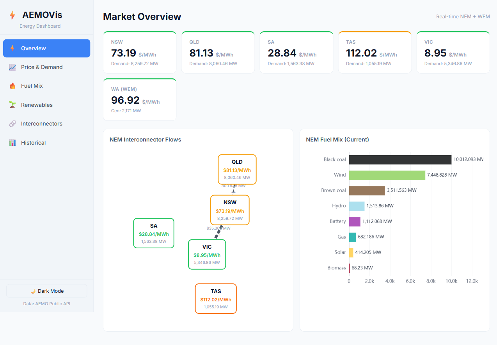

### What it shows

The Overview page provides a live snapshot of the entire Australian electricity market:

- **KPI Cards** — Current price ($/MWh) and demand (MW) for each NEM region (NSW, QLD, VIC, SA, TAS) plus WA (WEM)
- **Interconnector Flow Map** — SVG visualisation showing power flow between NEM regions with MW values and direction arrows
- **NEM Fuel Mix** — Horizontal bar chart showing current generation by fuel type across all NEM regions

### How to use it

- Cards are colour-coded by region (border colour matches region identity)
- The interconnector map shows flow direction with animated arrows — thicker lines indicate higher flow
- Click region nodes on the flow map for price/demand detail
- Data refreshes automatically every 5 minutes

### Data refresh

| Data | Interval |
|------|----------|
| Region prices & demand | 5 min (auto) |
| Interconnector flows | 5 min (auto) |
| NEM fuel mix | 5 min (stale) |
| WA market pulse | 5 min (auto) |

### AEMO equivalent

- [NEM Data Dashboard](https://www.aemo.com.au/energy-systems/electricity/national-electricity-market-nem/data-nem/data-dashboard-nem) — Summary view
- [WEM Data Dashboard](https://www.aemo.com.au/energy-systems/electricity/wholesale-electricity-market-wem/data-wem/data-dashboard) — WA summary

---

## Price & Demand Page (`/price-demand`)

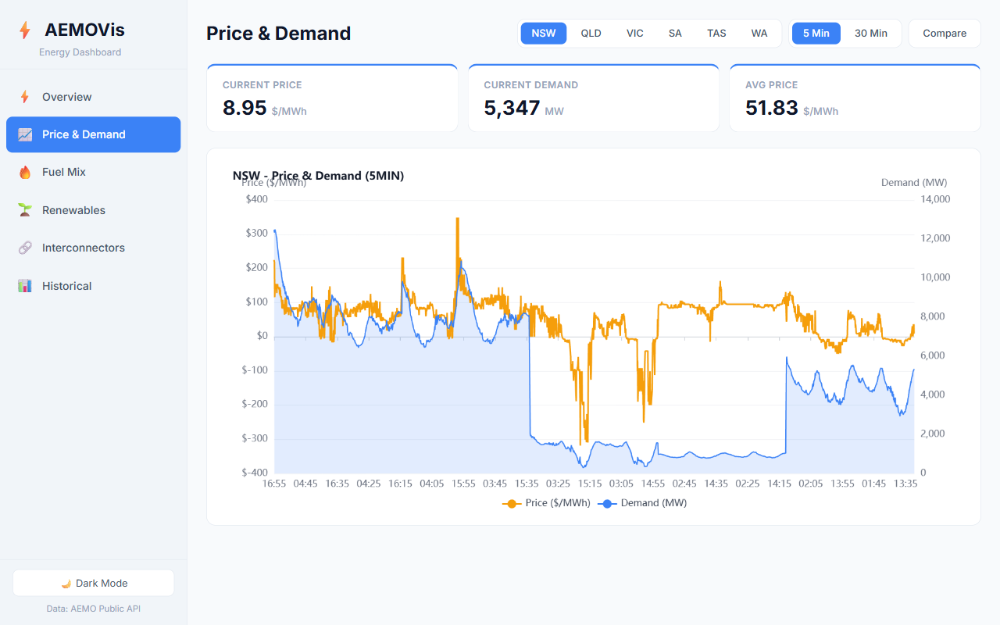

### What it shows

A dual-axis time series chart displaying:

- **Price** ($/MWh) on the left Y-axis — shown as an orange line
- **Demand** (MW) on the right Y-axis — shown as a blue area fill

Three KPI cards above the chart show:

- **Current Price** — Latest dispatch interval price
- **Current Demand** — Latest total demand
- **Avg Price** — Average price over the displayed period

### How to use it

- **Region selector** — Choose from NSW, QLD, VIC, SA, TAS, or WA
- **Time scale toggle** — Switch between `5 Min` (dispatch intervals) and `30 Min` (trading intervals)
- **Compare button** — Enable comparison mode (see Section 6)
- Hover over the chart to see exact values at each timestamp
- WA shows WEM market pulse data (price and generation) instead of NEM data

### How to interpret

- **Price spikes** (tall orange peaks) indicate supply constraints or high demand events
- **Negative prices** (orange line below $0) indicate excess generation, usually from renewables
- **Demand patterns** follow daily cycles — rising in morning, peaking in evening, lowest overnight
- The 5MIN view shows more volatile dispatch prices; 30MIN shows smoother trading intervals

### Data refresh

Stale after 5 minutes. No auto-refresh — navigate away and back, or the cache will serve fresh data when stale.

---

## Fuel Mix Page (`/fuel-mix`)

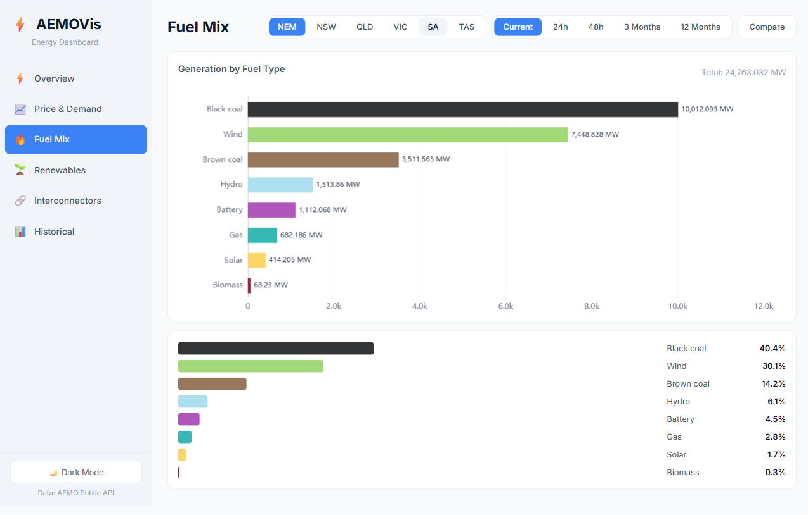

### What it shows

- **Horizontal bar chart** — Generation by fuel type, sorted by MW output (descending)
- **Percentage breakdown** — Stacked percentage bars with fuel type labels and percentages
- **Total generation** — Sum of all fuel types in MW

### How to use it

- **Region selector** — NEM (all regions combined), or individual regions (NSW, QLD, VIC, SA, TAS)
- **Period selector** — `Current` (live snapshot in MW), `24h`, `48h`, `3 Months`, `12 Months` (period totals in MWh)
- **Compare button** — Compare fuel mix between two regions

### How to interpret

- **Current** period shows instantaneous generation in MW — a snapshot of what generators are producing right now
- **Historical periods** (24h, 48h, 3M, 12M) show cumulative energy production in MWh
- Bar colours match fuel type colours (see Fuel Type Colours table in Section 7)
- Fossil fuels appear at the top when dominant; renewables show their relative contribution

### Data refresh

Stale after 5 minutes. Client-side filtering means the API response covers all regions.

---

## Renewables Page (`/renewables`)

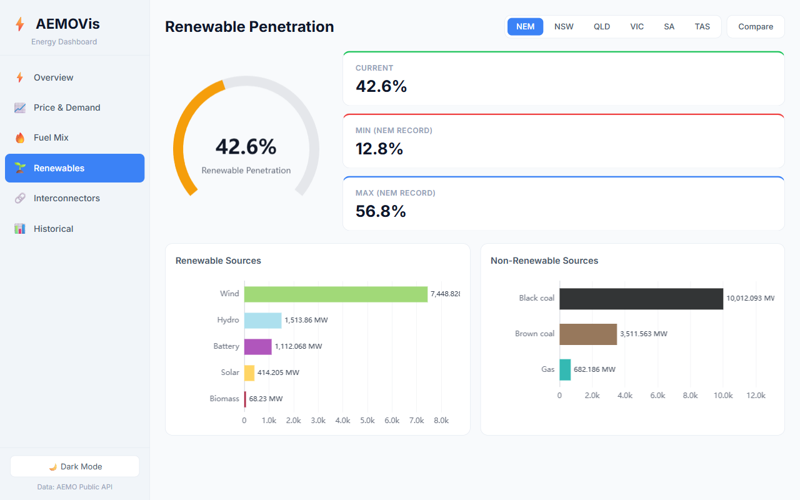

### What it shows

- **Gauge chart** — Large circular gauge showing current renewable penetration percentage (0–100%)
- **KPI cards** — Current %, NEM-wide minimum record, NEM-wide maximum record
- **Renewable sources** — Horizontal bar chart of individual renewable fuel types (Wind, Hydro, Battery, Solar, Biomass)
- **Non-renewable sources** — Horizontal bar chart of fossil fuel types (Black Coal, Brown Coal, Gas)

### How to use it

- **Region selector** — NEM (aggregate) or individual regions
- **Compare button** — Side-by-side comparison of renewable penetration between regions

### How to interpret

- The gauge needle position and percentage show how much of current generation comes from renewable sources
- **Min/Max records** are NEM-wide historical records (not per-region)
- Higher penetration in SA and TAS reflects their wind and hydro resources
- Lower penetration in QLD and NSW reflects their coal fleet dominance

### Data refresh

Stale after 5 minutes.

---

## Interconnectors Page (`/interconnectors`)

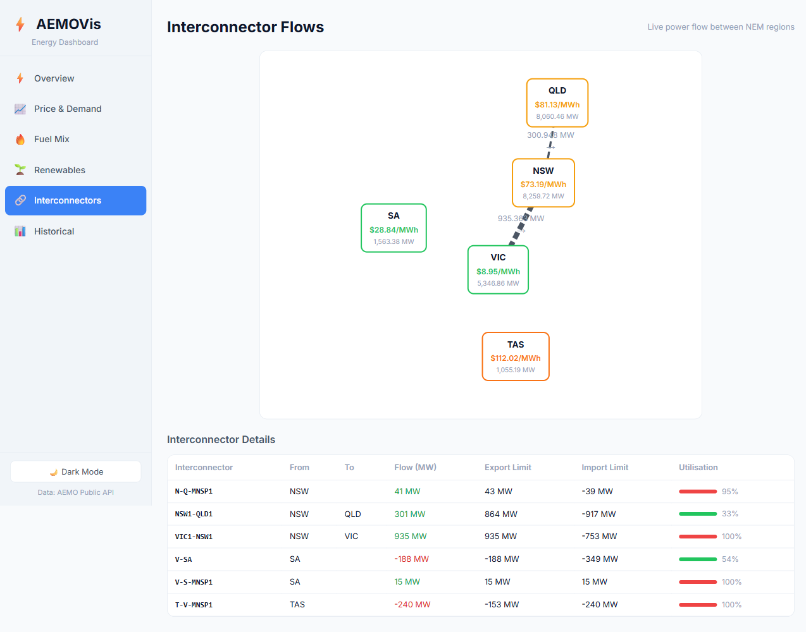

### What it shows

- **Flow map** — SVG visualisation of NEM regions with interconnector lines and flow annotations
- **Detail table** — All interconnectors with: ID, From region, To region, Flow (MW), Export limit, Import limit, Utilisation %

### How to use it

- The flow map shows direction of power flow between regions
- The table provides precise MW values and capacity utilisation
- Utilisation bars are colour-coded: green (< 70%), orange (70–90%), red (> 90%)

### How to interpret

- **Positive flow** — Power flowing from the "From" region to the "To" region
- **Negative flow** — Power flowing in the reverse direction
- **High utilisation** (red) means the interconnector is near capacity — a potential bottleneck
- Flow direction typically moves from low-price to high-price regions (power flows to where it's needed most)

### NEM Interconnectors

| Interconnector ID | From | To | Description |
|-------------------|------|----|-------------|
| NSW1-QLD1 | NSW | QLD | Main NSW–QLD interconnector |
| N-Q-MNSP1 | NSW | QLD | Directlink (market network service) |
| VIC1-NSW1 | VIC | NSW | Main VIC–NSW interconnector |
| V-SA | VIC | SA | Heywood interconnector |
| V-S-MNSP1 | VIC | SA | Murraylink (market network service) |
| T-V-MNSP1 | TAS | VIC | Basslink (undersea cable) |

### NEM Region Map

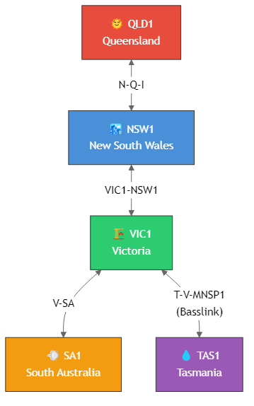

### Data refresh

Interconnector data comes from `elecSummary`, which auto-refreshes every 5 minutes.

---

## Historical Page (`/historical`)

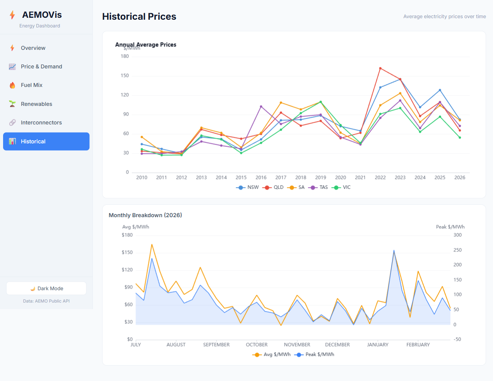

### What it shows

- **Annual Average Prices** — Multi-line chart showing average $/MWh per year for all NEM regions (2010–present)
- **Monthly Breakdown** — Dual-axis chart showing average and peak prices by month for the current financial year

### How to use it

- The annual chart shows long-term price trends with colour-coded lines per region
- The monthly chart shows seasonal patterns with average prices (orange line) and peak prices (blue area)
- Hover over data points for exact values

### How to interpret

- **Annual trends** reveal long-term market shifts (e.g., the 2022 energy crisis, carbon price effects in 2012–2014)
- **Monthly patterns** show seasonal demand cycles — higher prices in winter (heating) and summer (cooling)
- SA typically has the highest prices due to its generation mix and interconnector constraints
- VIC and TAS tend to have lower average prices

### Data refresh

Historical data uses a 1-hour stale time since it changes infrequently.

---

# 6. Region Comparison Mode

## How to Enable

1. Navigate to **Price & Demand**, **Fuel Mix**, or **Renewables**
2. Select a primary region (e.g., NSW)
3. Click the **Compare** button
4. A second region selector appears — choose the comparison region (e.g., VIC)
5. Select **Overlay** or **Split** view mode

## Overlay Mode


In overlay mode, both regions' data is displayed on the same chart:

- **Region A** (primary) uses solid colours and lines
- **Region B** (comparison) uses slightly different shading for differentiation
- Side-by-side gauges for renewable penetration
- Grouped bars for fuel mix comparison
- Legends distinguish the two regions

## Split Mode

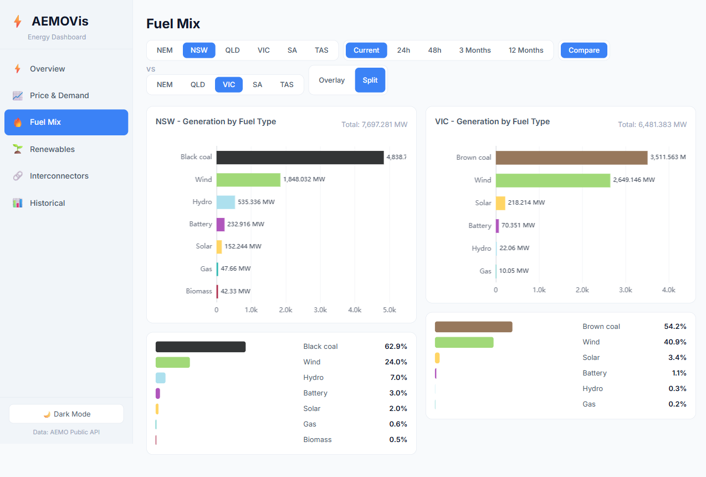

In split mode, each region gets its own panel:

- **Left panel** — Region A (primary)
- **Right panel** — Region B (comparison)
- Each panel is a complete, independent view
- Easier to read when data ranges differ significantly

## What Can Be Compared

| Page | Comparison Support | Notes |
|------|--------------------|-------|
| Price & Demand | Yes | Overlay shows dual lines; Split shows side-by-side charts |
| Fuel Mix | Yes | Overlay shows grouped bars; Split shows independent breakdowns |
| Renewables | Yes | Overlay shows dual gauges + grouped bars; Split shows independent panels |
| Overview | No | Summary page — no comparison |
| Interconnectors | No | Already shows all regions |
| Historical | No | Already shows all regions on annual chart |

## WA Limitation

**WA (WEM) does not support comparison mode.** The WEM is a separate market from the NEM and only has the `marketPulse` endpoint. When WA is selected as the primary region, the Compare button is disabled.

---

# 7. Understanding the Data

## Price ($/MWh)

### Regional Reference Price (RRP)

The price shown in AEMOVis is the **Regional Reference Price (RRP)** — the spot price of electricity at the regional reference node. This is the price at which generators are paid and consumers are charged for wholesale electricity.

### Dispatch vs Trading Intervals

| Interval | Duration | Use |
|----------|----------|-----|
| 5-minute dispatch interval | 5 min | Real-time dispatch and pricing since October 2021 |
| 30-minute trading interval | 30 min | Legacy settlement period; average of six 5-min dispatch prices |

The **5 Min** view shows raw dispatch prices (more volatile). The **30 Min** view shows trading interval averages (smoother).

### Negative Prices

Negative prices occur when there is **excess generation** — typically during periods of high renewable output (midday solar, overnight wind) and low demand. Generators may bid negative to stay online (avoiding costly shutdown/restart cycles), effectively paying the market to take their power.

### Price Spikes

Price spikes occur when:

- Demand exceeds available supply (hot summer afternoons, cold winter evenings)
- Generator outages reduce available capacity
- Interconnector constraints limit imports from lower-priced regions
- The NEM price cap is $17,500/MWh (as of 2024/25)

## Demand (MW)

### Scheduled vs Total Demand

- **Total demand** — All electricity consumption in a region, including rooftop solar self-consumption estimates
- **Scheduled demand** — Demand met by scheduled (dispatchable) generators

### Regional Demand Patterns

| Region | Typical Demand | Characteristics |
|--------|---------------|-----------------|
| NSW | 6,000–12,000 MW | Largest NEM region by demand; Sydney metro drives peaks |
| QLD | 5,000–10,000 MW | High industrial load; summer cooling peaks |
| VIC | 4,000–8,000 MW | Strong seasonal variation; winter heating demand |
| SA | 1,000–3,000 MW | Smallest mainland NEM region; wind-dominated supply |
| TAS | 800–1,500 MW | Smallest NEM region; hydro-dominated supply |

## Fuel Mix

### Fuel Type Colours

| Fuel Type | Colour | Hex | Renewable |
|-----------|--------|-----|-----------|
| Black Coal | Dark grey | `#333536` | No |
| Brown Coal | Brown | `#97785C` | No |
| Gas / Natural Gas | Teal | `#34B9B3` | No |
| Liquid Fuel | Coral red | `#FE5F55` | No |
| Wind | Green | `#A1D978` | Yes |
| Solar | Yellow | `#FFD565` | Yes |
| Hydro | Light blue | `#ADE0EE` | Yes |
| Battery | Purple | `#B056BC` | Yes |
| Biomass | Dark red | `#A82140` | Yes |
| Rooftop PV / Solar | Pale yellow | `#FFED90` | Yes |
| Distributed PV | Pale yellow | `#FFED90` | Yes |

### What Each Fuel Type Means

- **Black Coal** — Hard coal primarily burned in NSW and QLD. Baseload generation, high emissions.
- **Brown Coal** — Lignite burned exclusively in VIC (Latrobe Valley). Lower energy density, higher emissions per MWh.
- **Gas / Natural Gas** — Gas turbines (open-cycle for peaking, combined-cycle for mid-merit). Flexible but expensive.
- **Liquid Fuel** — Diesel generators, typically emergency/backup. Rarely visible in the mix.
- **Wind** — Onshore wind farms across SA, VIC, NSW, and QLD. Variable output dependent on weather.
- **Solar** — Utility-scale solar farms. Output follows daylight hours, peaks at midday.
- **Hydro** — Hydroelectric dams and pumped hydro (Snowy Hydro, TAS hydro). Dispatchable renewable.
- **Battery** — Grid-scale batteries (e.g., Hornsdale Power Reserve). Charge during low prices, discharge during peaks.
- **Biomass** — Sugarcane bagasse (QLD) and other organic fuel sources. Small but consistent output.
- **Rooftop PV** — Estimated generation from residential and commercial rooftop solar panels.

### Current vs Historical Periods

| Period | Unit | Meaning |
|--------|------|---------|
| Current | MW | Instantaneous generation right now |
| 24h / 48h | MWh | Cumulative energy produced over the period |
| 3 Months / 12 Months | MWh | Cumulative energy produced over the period |

## Renewable Penetration

### How Percentage is Calculated

**Renewable % = (Renewable Generation MW / Total Generation MW) x 100**

Renewable sources include: Wind, Solar, Hydro, Battery (discharge), Biomass, Rooftop PV.

### NEM-Wide Records

The min and max records shown on the Renewables page represent the highest and lowest instantaneous renewable penetration ever recorded across the entire NEM. These are historical benchmarks — the current percentage may be above the displayed max if a new record is being set.

### Per-Region vs NEM-Wide

- **NEM** — Aggregate across all five NEM regions
- **Per-region** — Calculated from the fuel mix data for that specific region
- SA regularly exceeds 100% renewable penetration (exporting excess to VIC)
- TAS is predominantly hydro-powered, with high baseline renewable %

## Interconnectors

### What Interconnectors Are

Interconnectors are high-voltage transmission lines that link NEM regions, allowing power to flow between states. They are critical for:

- Balancing supply and demand across regions
- Sharing renewable energy from high-generation areas
- Providing backup during generator outages
- Enabling price arbitrage between regions

### Flow Direction and Values

- **Positive MW** — Power flows from the named export region to the import region
- **Negative MW** — Power flows in the reverse direction
- Flow magnitude indicates how much power is being transferred
- Flow direction typically follows price signals (power flows from low-price to high-price regions)

### Export/Import Limits and Utilisation

- **Export limit** — Maximum MW the interconnector can carry in the forward direction
- **Import limit** — Maximum MW in the reverse direction (shown as negative)
- **Utilisation %** — Current flow as a percentage of the applicable limit

### Interconnector Reference

| ID | Regions Connected | Type | Capacity (approx.) |
|----|-------------------|------|---------------------|
| NSW1-QLD1 | NSW ↔ QLD | Regulated | ~600–900 MW |
| N-Q-MNSP1 | NSW ↔ QLD | Market (Directlink) | ~40–110 MW |
| VIC1-NSW1 | VIC ↔ NSW | Regulated | ~700–1,100 MW |
| V-SA | VIC ↔ SA | Regulated (Heywood) | ~200–600 MW |
| V-S-MNSP1 | VIC ↔ SA | Market (Murraylink) | ~220 MW |
| T-V-MNSP1 | TAS ↔ VIC | Market (Basslink) | ~480 MW |

## WA (Wholesale Electricity Market)

### Separate Market

Western Australia operates the **Wholesale Electricity Market (WEM)**, which is entirely separate from the NEM. The WEM covers the South West Interconnected System (SWIS) — the main grid in south-west WA including Perth.

### Available Data

The WEM `marketPulse` endpoint provides:

| Field | Description |
|-------|-------------|
| Price ($/MWh) | Current WEM energy price |
| Forecast Generation (MW) | Predicted total generation |
| Actual Total Generation (MW) | Measured total generation (may be null for future intervals) |
| RTD Total Generation (MW) | Real-time dispatch generation |
| Forecast NSG (MW) | Non-scheduled generation forecast |
| Actual NSG (MW) | Non-scheduled generation actual |
| Total Outage (MW) | Combined planned + forced outages |
| Planned Outage (MW) | Scheduled maintenance outages |
| Forced Outage (MW) | Unplanned outages |

### WA Limitations in AEMOVis

- No fuel mix breakdown
- No renewable penetration data
- No interconnector data (WA is isolated from the NEM)
- No historical price data through this API
- Comparison mode is disabled for WA

For more WEM data, see: <https://www.aemo.com.au/energy-systems/electricity/wholesale-electricity-market-wem>

---

# 8. Security & Risk Review

## API Key Exposure

The AEMO API key is included in the client-side JavaScript source code (`src/api/client.ts`). This is a **low risk** because:

- The AEMO public API serves publicly available market data
- No authentication beyond the API key is required
- The data contains no PII or sensitive information
- The key is freely available through AEMO's developer portal

**Production recommendation:** Move the API key to an environment variable and inject it at build time or via a backend proxy.

## Cross-Origin (CORS)

- In development, the Vite proxy handles CORS by rewriting `/api` requests to AEMO's domain
- In production, a reverse proxy (Nginx, Caddy, Cloudflare Worker) must be configured to:
  - Forward `/api/*` requests to `https://dashboards.public.aemo.com.au`
  - Attach the `x-api-key` header server-side
  - Return appropriate CORS headers to the browser

## Security Summary

| Area | Status | Notes |
|------|--------|-------|
| Authentication | N/A | Public API, no user auth needed |
| PII / Sensitive data | None | All data is publicly available market data |
| XSS | Low risk | React handles escaping; ECharts renders to `<canvas>` |
| Injection | Low risk | No user input reaches API queries |
| Dependencies | Standard | React, ECharts, TanStack Query — all well-maintained packages |
| Rate limiting | AEMO-managed | 5-min staleTime prevents excessive calls |
| HTTPS | Yes | All API calls use HTTPS via proxy |

## Production Deployment Considerations

1. **API key** — Move from client source to server-side environment variable
2. **Reverse proxy** — Configure Nginx/Caddy to forward `/api` requests with the key header
3. **Build** — Run `vite build` to produce static assets for deployment
4. **CDN** — Serve static assets from a CDN; only `/api` needs server handling
5. **Monitoring** — Consider adding error tracking (Sentry) for API failures

---

# 9. Glossary

| Term | Definition |
|------|-----------|
| **AEMO** | Australian Energy Market Operator — operates Australia's electricity and gas markets |
| **NEM** | National Electricity Market — the interconnected electricity market covering QLD, NSW, VIC, SA, and TAS |
| **WEM** | Wholesale Electricity Market — the electricity market for Western Australia's SWIS |
| **SWIS** | South West Interconnected System — the main electricity grid in south-west WA |
| **RRP** | Regional Reference Price — the wholesale spot price of electricity at a region's reference node ($/MWh) |
| **MW** | Megawatt — a unit of electrical power (rate of energy production/consumption) |
| **MWh** | Megawatt-hour — a unit of energy (1 MW sustained for 1 hour) |
| **Dispatch interval** | A 5-minute period used for real-time dispatch and pricing in the NEM |
| **Trading interval** | A 30-minute period used for financial settlement in the NEM |
| **Interconnector** | A high-voltage transmission link between NEM regions |
| **MNSP** | Market Network Service Provider — a privately owned interconnector that participates in the market |
| **Baseload** | Generation that runs continuously (e.g., coal, nuclear) |
| **Peaking** | Generation that runs only during high-demand periods (e.g., gas turbines) |
| **Renewable penetration** | The percentage of current generation from renewable sources |
| **Fuel mix** | The combination of generation sources (coal, gas, wind, solar, etc.) supplying the grid |
| **Stale time** | The duration after which cached data is considered outdated and eligible for re-fetching |
| **SPA** | Single Page Application — a web app that loads once and dynamically updates content |

---

# 10. Region Reference

## NEM Regions

| Region ID | Label | State/Territory | Characteristics |
|-----------|-------|-----------------|-----------------|
| NSW1 | NSW | New South Wales | Largest demand region; black coal + growing renewables |
| QLD1 | QLD | Queensland | High industrial load; black coal + solar growth |
| VIC1 | VIC | Victoria | Brown coal legacy; rapid wind expansion |
| SA1 | SA | South Australia | Wind-dominated; frequent negative prices; battery storage pioneer |
| TAS1 | TAS | Tasmania | Hydro-dominated; low prices; connected to VIC via Basslink |

## Region Colours (used in charts)

| Region | Colour | Hex |
|--------|--------|-----|
| NSW | Blue | `#4A90D9` |
| QLD | Red | `#E74C3C` |
| VIC | Green | `#2ECC71` |
| SA | Orange | `#F39C12` |
| TAS | Purple | `#9B59B6` |

## WEM

| Region | Label | Area | Characteristics |
|--------|-------|------|-----------------|
| WA | WA (WEM) | South-west Western Australia | Isolated grid; gas + renewables; no interconnectors to NEM |

---

*Document generated February 2026. Data sourced from AEMO's public API.*
*AEMOVis is an independent visualisation tool and is not affiliated with or endorsed by AEMO.*
